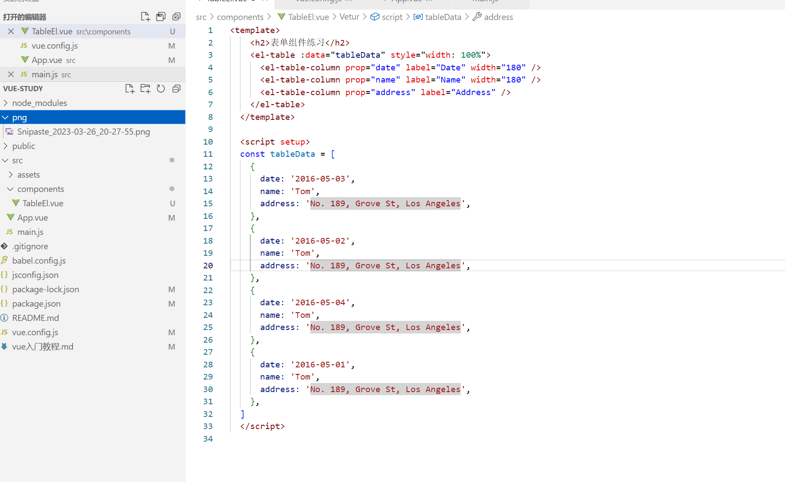
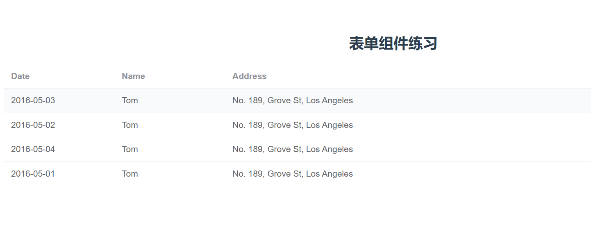

## 1. Node.js 安装

### 1.1 node.js下载

下载地址：http://api.nodejs.cn/

验证是否正确安装 windows cmd命令窗口 `node -v`  我自己安装的版本：v16.17.0

验证npm的版本 `npm -v`  我显示的版本: 8.15.0 

### 1.2 更换源

1. 更换npm安装程序的默认位置：`npm config set prefix "E:\Program Files\node_global"`

2. 更换npm安装程序的缓存位置：`npm config set cache "E:\Program Files\node_cache"`

3. 更换淘宝镜像：
   
   - `npm install -g npm --registry=https://registry.npm.taobao.org`
   
   - `npm config set registry https://registry.npm.taobao.org`

4. 配置环境变量：将1中的路径配置到PATH系统变量下

### 1.3 打包和脚手架

1. 安装webpack打包工具
   
   - webpack: `npm install webpack -g`
   
   - 脚手架：`npm install webpack-cli -g`
   
   - 测试打包工具是否安装成功：`webpack -v` 我自己安装的版本：5.74.0

2. 安装vue脚手架：`npm install -g @vue/cli`  我的版本： 5.0.8

3. 安装TypeScript-javaScript超集：`npm install -g typescript`

4. yarn（javaScript软件包管理器）安装：`npm install -g yarn`

5. 创建vue项目：`vue create project-name`

6. 运行vue：`npm run serve`

此时，访问http://localhost:8080/，可以看到下面的页面：


## 2. element-ui使用

### 2.1 安装和导入

`npm install element-plus --save`

自动导入：`npm install -D unplugin-vue-components unplugin-auto-import`

在项目的根路径的vue.config.js文件加上：

```javascript
// webpack.config.js
const AutoImport = require('unplugin-auto-import/webpack')
const Components = require('unplugin-vue-components/webpack')
const { ElementPlusResolver } = require('unplugin-vue-components/resolvers')

module.exports = {
  // ...
  plugins: [
    AutoImport({
      resolvers: [ElementPlusResolver()],
    }),
    Components({
      resolvers: [ElementPlusResolver()],
    }),
  ],
}
```

### 2.2 表单CRUD

#### 2.2.1 显示

在项目的components中，创建TableEl.vue文件，并将官方Table的代码复制进去



<font color = red>注意，<script lang='ts'>中存在lang属性会报错，这里已经去掉了</font>

此时项目访问后，成功达到想要的结果。为了方便后面的添加，这里把tableData变量内容清空。并重新定义在 export default中的data()当中。



#### 2.2.1 添加

<font color=blue>期望效果：在table左边增加添加按钮，并点击后弹出添加的控件(对话框)。</font>

使用el-dialog组件，并v-model绑定addVisiable布尔值，v-if控制渲染。添加按钮点击的时候，将布尔值设置成为true。确认按钮调用添加方法。

```html
    <!-- 添加按钮 -->
    <el-button type="primary" @click="addVisiable = true">添加</el-button>
    <!-- 添加弹出对话框 -->
    <el-dialog v-model="addVisiable" append-to-body>
      <el-form
        :model="addData"
        label-width="120px"
        :tableForm="tableForm"
        v-if="addVisiable"
      >
        <el-form-item label="名称">
          <el-input v-model="addData.name" />
        </el-form-item>
        <el-form-item label="金额">
          <el-input v-model="addData.money" />
        </el-form-item>
        <el-form-item label="类型">
          <el-input v-model="addData.type" />
        </el-form-item>
        <span>
          <el-button type="primary" plain @click="addVisiable = false">
            取消
          </el-button>
          <el-button type="primary" @click="addTableData"> 确认 </el-button>
        </span>
      </el-form>
    </el-dialog>
```

#### 2.2.2 删除

<font color=blue>期望效果: 通过二次气泡确认框，将对应行删除</font>

使用v-slot="scop"获取当前操作的行。scop.row获取当前行数据，scop.$index获取当前行下标。

气泡确认框使用v-popconfirm， 并使用#reference关连删除按钮。

```html
      <!-- 汽包确认框 -->
      <template v-slot="scop">
        <el-button type="primary" @click="activeUpdate(scop.$index)"
          >更改</el-button
        >
        <el-popconfirm title="确认删除?" @confirm="delTableData(scop.$index)">
          <template #reference>
            <el-button type="danger">删除</el-button>
          </template>
        </el-popconfirm>
      </template>
```

#### 2.2.3 更改

<font color=blue>期望效果：增加更改按钮，并和添加一样，出现弹窗进行当前行的数据更改</font>

使用scop.$index记录需要更改的当前行，scop.row显示当前更改行数据。并对原始table的值更改，达到更改效果。

代码略

#### 2.2.4 查询

<font color=blue>期望效果：增加名称搜索框，能通过名称过滤得到目标值</font>

```html

```