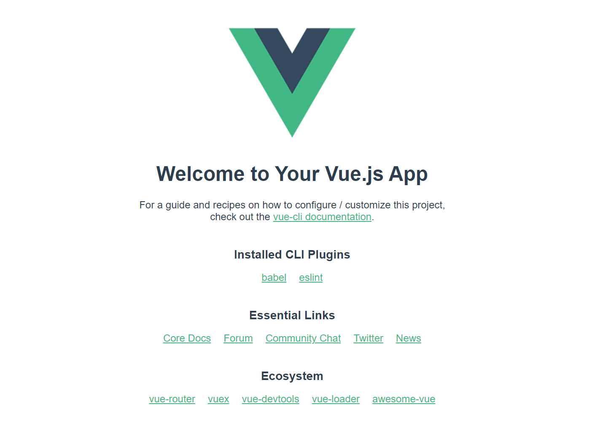

## 1. Node.js 安装

### 1.1 node.js下载

下载地址：http://api.nodejs.cn/

验证是否正确安装 windows cmd命令窗口 `node -v`  我自己安装的版本：v16.17.0

验证npm的版本 `npm -v`  我显示的版本: 8.15.0 

### 1.2 更换源

1. 更换npm安装程序的默认位置：`npm config set prefix "E:\Program Files\node_global"`

2. 更换npm安装程序的缓存位置：`npm config set cache "E:\Program Files\node_cache"`

3. 更换淘宝镜像：
   
   - `npm install -g npm --registry=https://registry.npm.taobao.org`
   
   - `npm config set registry https://registry.npm.taobao.org`

4. 配置环境变量：将1中的路径配置到PATH系统变量下

### 1.3 打包和脚手架

1. 安装webpack打包工具
   
   - webpack: `npm install webpack -g`
   
   - 脚手架：`npm install webpack-cli -g`
   
   - 测试打包工具是否安装成功：`webpack -v` 我自己安装的版本：5.74.0

2. 安装vue脚手架：`npm install -g @vue/cli`  我的版本： 5.0.8

3. 安装TypeScript-javaScript超集：`npm install -g typescript`

4. yarn（javaScript软件包管理器）安装：`npm install -g yarn`

5. 创建vue项目：`vue create project-name`

6. 运行vue：`npm run serve`

此时，访问http://localhost:8080/，可以看到下面的页面：

## element-ui使用

### 安装

`npm install element-plus --save`